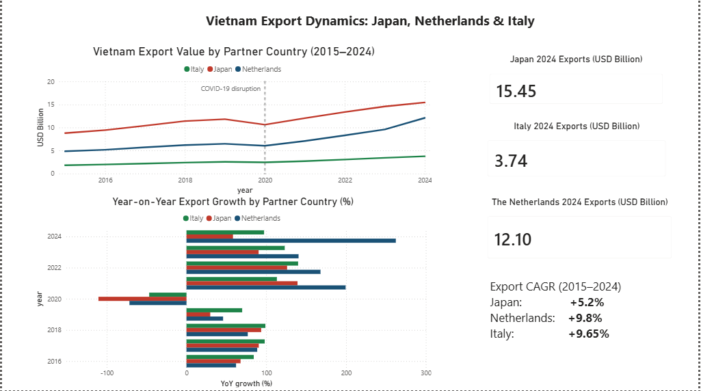
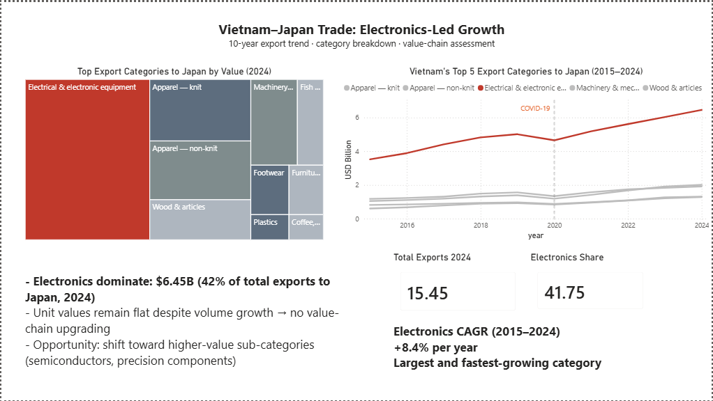
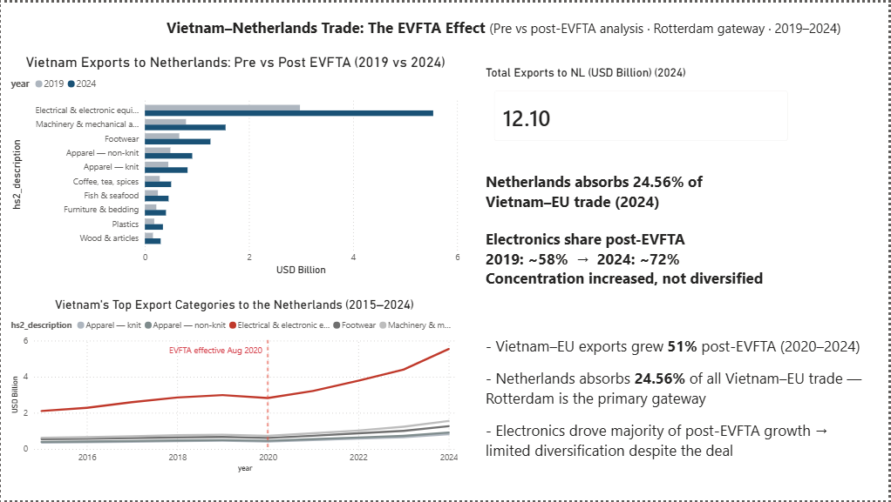
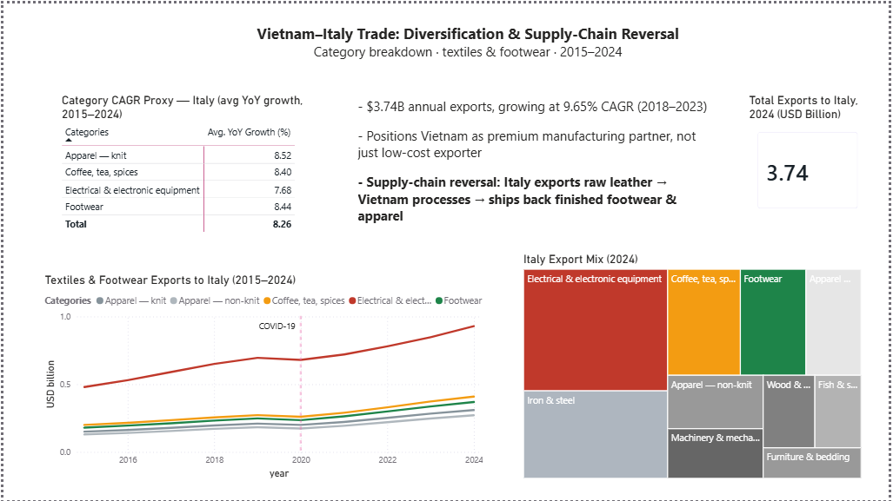
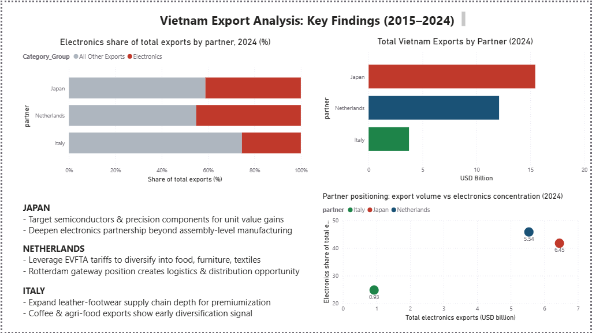

# Vietnam Export Dynamics: Japan, Netherlands & Italy (2015–2024)

A bilateral trade analysis built on UN Comtrade data, examining how Vietnam's export relationships with three partners evolved over ten years — and what the composition shifts reveal about Vietnam's position in global supply chains.

**Tools:** Python · SQLite · Power BI Desktop  
**Data:** UN Comtrade · World Bank · Eurostat  
**Output:** 5-tab Power BI dashboard · business memo · methodology documentation

---

## Research Question

How have Vietnam's exports to Japan, the Netherlands, and Italy changed between 2015 and 2024 — and does the data show value-chain advancement or volume-led stagnation?

**Sub-questions:**
- Japan: Which categories drive growth, and do unit economics improve over time?
- Netherlands: Did the EVFTA (August 2020) produce export diversification or concentration?
- Italy: Where does Vietnam sit in Italy's leather and footwear supply chain?

---

## Key Findings

**Netherlands — EVFTA produced concentration, not diversification.**  
Exports to the Netherlands grew 51% post-EVFTA (2020–2024). Electronics share rose from ~58% (2019) to ~72% (2024). The trade agreement increased trade volume but deepened category dependence rather than broadening it.

**Japan — Volume growth without value-chain advancement.**  
Electronics dominate at 41.75% of 2024 exports ($6.45B). The category grew at 8.4% CAGR but unit values remained flat, indicating Vietnam participates at assembly level rather than capturing design or component margins.

**Italy — Supply-chain reversal as competitive signal.**  
Italy exports raw leather to Vietnam; Vietnam returns finished footwear and apparel. This is the clearest evidence of Vietnam moving up a value chain in any of the three relationships. Exports grow at 9.65% CAGR with footwear and coffee/spices both accelerating.

**Cross-partner conclusion:** Vietnam holds a high-volume, mid-complexity manufacturing position across all three partners. Electronics dominate every bilateral relationship. No partner shows meaningful diversification away from this pattern — the EVFTA finding makes that explicit.

---

## Dashboard

Five tabs. Each tab covers one analytical layer.

| Tab | Content |
|-----|---------|
| Overview | 10-year export trend by partner · YoY growth · CAGR summary |
| Japan | Category treemap · top-5 trend lines · electronics dominance |
| Netherlands | Pre/post-EVFTA comparison · electronics concentration shift |
| Italy | CAGR table by category · textiles/footwear trend · export mix |
| Key Findings | Electronics share by partner · partner positioning scatter · strategic recommendations |

**File:** `dashboard/vietnam_trade_analysis_dashboard.pbix`  
Requires Power BI Desktop (free). Download at [powerbi.microsoft.com](https://powerbi.microsoft.com/desktop/).

---

## Dashboard Preview

### Overview


### Japan


### Netherlands


### Italy


### Key Findings


---

## Data Pipeline

```
UN Comtrade API
    └── 01_collect_data.py       # Pull bilateral trade data by HS2 code
    └── 02_clean_data.py         # Standardize, filter, handle nulls
    └── 03_run_analysis.py       # Generate derived metrics (CAGR, YoY, share)
    └── clean_combined.csv       # Primary analysis table
    └── clean_eurostat_eu_vnm_totals.csv  # EU-level totals for share calculation
    └── clean_wb_indicators.csv  # World Bank GDP/trade context data
```

Run the full pipeline:
```bash
pip install -r requirements.txt
python run_pipeline.py
```

---

## Methodology

**Data source:** UN Comtrade bilateral export records, HS2 classification, reporter = Vietnam, partners = Japan (392), Netherlands (528), Italy (380).

**Time range:** 2015–2024. 2015 chosen as baseline — pre-EVFTA, pre-US-China trade war FDI shift into Vietnam.

**CAGR calculation:** Compound annual growth rate on USD trade values, calculated as `(end/start)^(1/n) - 1`.

**Electronics concentration:** Share of total bilateral export value attributable to HS2 code 85 (Electrical & electronic equipment).

**Post-EVFTA period:** 2020–2024. EVFTA entered force August 1, 2020.

**Excluded:** Unit value analysis (USD/kg) excluded due to weight reporting gaps in Comtrade data for Vietnam bilateral flows. This is noted as a data limitation.

Full methodology: `methodology.md`

---

## Repo Structure

```
vietnam-trade-analysis/
├── dashboard/
│   └── vietnam_trade_analysis_dashboard.pbix
├── screenshots/
│   ├── overview.png
│   ├── japan.png
│   ├── netherlands.png
│   ├── italy.png
│   └── key_findings.png
├── data/
│   ├── clean_combined.csv
│   ├── clean_eurostat_eu_vnm_totals.csv
│   ├── clean_wb_indicators.csv
│   ├── [numbered SQL and CSV query files]
├── Vietnam_Trade_Memo.pdf
├── run_pipeline.py
├── requirements.txt
├── methodology.md
├── results_summary.md
└── README.md
```

---

## Author

Nguyễn Đăng Sơn  
Grade 11, Edison Schools Ecopark, Vietnam  
GitHub: [Jabariente](https://github.com/Jabariente)
